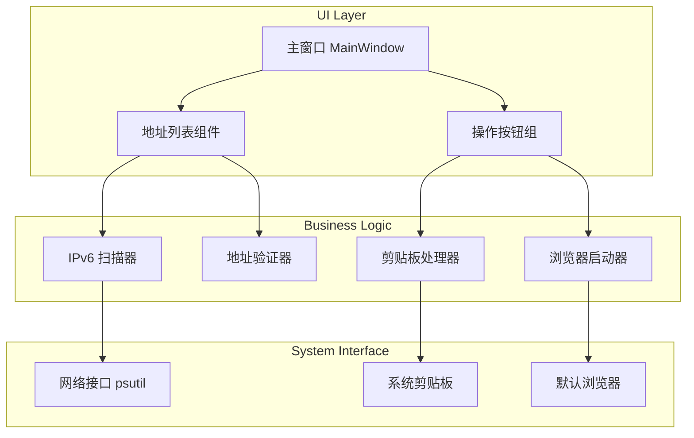

# Design Document: IPv6 Address Tool

## Overview

IPv6 Address Tool 是一个 Windows 桌面应用程序，使用 Python + PyQt6 构建 GUI 界面，通过 psutil 和 socket 库获取系统网络信息，最终使用 PyInstaller 打包为独立的 exe 文件。

## Architecture



## Components and Interfaces

### 1. IPv6Scanner (IPv6 扫描器)

负责扫描系统所有网络接口并获取 IPv6 地址。

```python
class IPv6Address:
    """IPv6 地址数据模型"""
    address: str           # IPv6 地址字符串
    interface_name: str    # 网络接口名称
    is_temporary: bool     # 是否为临时地址
    address_type: str      # 地址类型标签
    is_usable: bool        # 是否可用于外部通信

class IPv6Scanner:
    def scan_all_interfaces() -> List[IPv6Address]:
        """扫描所有网络接口，返回 IPv6 地址列表"""
        pass
    
    def get_interface_addresses(interface_name: str) -> List[IPv6Address]:
        """获取指定接口的 IPv6 地址"""
        pass
```

### 2. AddressValidator (地址验证器)

验证 IPv6 地址的类型和可用性。

```python
class AddressValidator:
    @staticmethod
    def validate(address: str) -> Tuple[str, bool]:
        """
        验证地址类型
        返回: (类型标签, 是否可用于外部通信)
        """
        pass
    
    @staticmethod
    def is_link_local(address: str) -> bool:
        """检查是否为链路本地地址 (fe80::)"""
        pass
    
    @staticmethod
    def is_loopback(address: str) -> bool:
        """检查是否为回环地址 (::1)"""
        pass
    
    @staticmethod
    def is_global_unicast(address: str) -> bool:
        """检查是否为全局单播地址"""
        pass
```

### 3. ClipboardHandler (剪贴板处理器)

处理复制到剪贴板的操作。

```python
class ClipboardHandler:
    def copy_to_clipboard(text: str) -> bool:
        """复制文本到剪贴板，返回是否成功"""
        pass
```

### 4. BrowserLauncher (浏览器启动器)

打开默认浏览器访问 IPv6 测试网站。

```python
class BrowserLauncher:
    IPV6_TEST_URL = "https://test-ipv6.com/"
    
    @staticmethod
    def open_ipv6_test():
        """打开 IPv6 测试网站"""
        pass
```

### 5. MainWindow (主窗口)

PyQt6 主窗口，包含所有 UI 组件。

```python
class MainWindow(QMainWindow):
    def __init__(self):
        """初始化主窗口"""
        pass
    
    def refresh_addresses(self):
        """刷新地址列表"""
        pass
    
    def copy_address(self, address: str):
        """复制指定地址到剪贴板"""
        pass
    
    def open_ipv6_test(self):
        """打开 IPv6 测试网站"""
        pass
```

## Data Models

### IPv6Address 数据结构

| 字段 | 类型 | 描述 |
|------|------|------|
| address | str | IPv6 地址字符串 |
| interface_name | str | 网络接口名称 |
| is_temporary | bool | 是否为临时地址 |
| address_type | str | 地址类型标签（链路本地/回环/全局单播） |
| is_usable | bool | 是否可用于外部通信 |

### 地址类型枚举

| 类型 | 前缀 | 可用性 | 显示标签 |
|------|------|--------|----------|
| 链路本地 | fe80:: | 不可用 | 链路本地地址（不可用于外部通信） |
| 回环地址 | ::1 | 不可用 | 本地回环地址 |
| 全局单播 | 2xxx:: 或 3xxx:: | 可用 | 可用于通信 |
| 唯一本地 | fc00:: 或 fd00:: | 局部可用 | 唯一本地地址 |


## Correctness Properties

*A property is a characteristic or behavior that should hold true across all valid executions of a system—essentially, a formal statement about what the system should do. Properties serve as the bridge between human-readable specifications and machine-verifiable correctness guarantees.*

### Property 1: 地址类型标签正确性

*For any* IPv6 地址，如果它是临时地址则标签为"临时地址"，如果是永久地址则标签为"正常地址"。地址的临时/永久属性与标签必须一致。

**Validates: Requirements 1.3, 1.4**

### Property 2: 链路本地地址识别

*For any* 以 "fe80" 开头的 IPv6 地址，验证器必须将其标记为"链路本地地址（不可用于外部通信）"，且 `is_usable` 必须为 `False`。

**Validates: Requirements 2.1**

### Property 3: 全局单播地址识别

*For any* 以 "2" 或 "3" 开头的有效 IPv6 地址（全局单播地址），验证器必须将其标记为"可用于通信"，且 `is_usable` 必须为 `True`。

**Validates: Requirements 2.3**

### Property 4: 剪贴板复制往返一致性

*For any* 有效的 IPv6 地址字符串，复制到剪贴板后再读取，得到的字符串必须与原始地址完全相同。

**Validates: Requirements 3.1**

### Property 5: 扫描完整性

*For any* 系统网络接口集合，扫描器返回的地址列表必须包含所有接口上的所有 IPv6 地址，不遗漏任何接口。

**Validates: Requirements 1.1, 1.2**

## Error Handling

### 网络接口错误

- 如果无法访问网络接口信息，显示错误提示并建议以管理员权限运行
- 如果特定接口读取失败，跳过该接口并继续扫描其他接口

### 剪贴板错误

- 如果剪贴板被其他程序锁定，显示"剪贴板被占用，请稍后重试"
- 复制失败时显示具体错误信息

### 浏览器启动错误

- 如果无法打开默认浏览器，显示错误提示并提供测试网站 URL 供手动复制

## Testing Strategy

### 单元测试

使用 pytest 进行单元测试：

- **AddressValidator 测试**: 测试各种 IPv6 地址格式的验证逻辑
- **IPv6Scanner 测试**: 使用 mock 测试扫描逻辑
- **ClipboardHandler 测试**: 测试剪贴板操作

### 属性测试

使用 hypothesis 进行属性测试：

- 生成随机 IPv6 地址测试验证器的正确性
- 测试剪贴板复制的往返一致性

### 测试配置

- 每个属性测试运行至少 100 次迭代
- 测试标签格式: **Feature: ipv6-address-tool, Property {number}: {property_text}**

## Technology Stack

| 组件 | 技术选择 | 说明 |
|------|----------|------|
| GUI 框架 | PyQt6 | 跨平台 GUI，Windows 原生外观 |
| 网络信息 | psutil | 获取网络接口信息 |
| 打包工具 | PyInstaller | 打包为独立 exe |
| 测试框架 | pytest + hypothesis | 单元测试 + 属性测试 |

## File Structure

```
ipv6-address-tool/
├── src/
│   ├── __init__.py
│   ├── main.py              # 程序入口
│   ├── scanner.py           # IPv6Scanner
│   ├── validator.py         # AddressValidator
│   ├── clipboard.py         # ClipboardHandler
│   ├── browser.py           # BrowserLauncher
│   └── ui/
│       ├── __init__.py
│       └── main_window.py   # MainWindow
├── tests/
│   ├── __init__.py
│   ├── test_validator.py
│   ├── test_scanner.py
│   └── test_clipboard.py
├── requirements.txt
├── build.spec              # PyInstaller 配置
└── README.md
```
